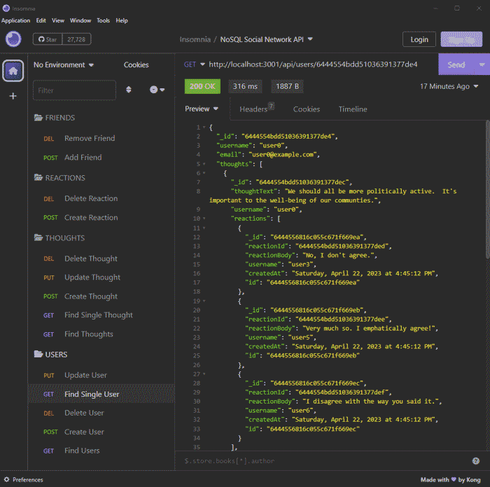

# NoSQL Social Network API

## Description
A simple example API for a social network written in [nodejs](https://nodejs.org/en) with [Express](https://expressjs.com/) using [MongoDB](https://www.mongodb.com/) as a document store and [Mongoose](https://www.mongoosejs.com/) for object-data modeling.  This application has no front end, but requests can be sent to the server from an API explorer tool like [Insomnia](https://insomnia.rest/).  

**Screencast: [Testing NoSQL Social Network API with Insomnia](https://watch.screencastify.com/v/Ca2mcITD9J2NMbRaGfbh)**

## Installation
(These instructions assume you have [MongoDB installed locally](https://www.mongodb.com/docs/manual/installation/).)
1. Clone this repository: `git clone git@github.com:kitrath/nosql-social-network-api`
2. Navigate to the base directory: `cd nosql-social-network-api`
3. Install dependencies: `npm install`
4. *Optional*: Create a `.env` file in the base directory.  Provide your mongodb connection information (see [./config/connection.js](config/connection.js)).
5. Seed the database: `npm run seed`.

## Usage
Start the API server with `npm start`. The server serves on `http://localhost:3001`. Exercise the API with a desktop API explorer tool like [Insomnia](https://insomnia.rest/). Stop the API server with `CTRL-C`.  

## Screenshot
Calling the API from *[Insomnia](https://insomnia.rest/)*

### API Endpoints

**GET**
- `/api/users`
- `/api/users/:userId`
- `/api/thougts`
- `/api/thoughts/:thoughtId`

**POST**
- `/api/users`
- `/api/thoughts`
- `/api/users/:userId/friends`
- `/api/thoughts/:thoughtId/reactions`

**PUT**
- `/api/users/:userId`
- `/api/thoughts/:thoughtId`

**DELETE**
- `/api/users/:userId`
- `/api/thoughts/:thoughtId`
- `/api/users/:userId/friends/:friendId`
- `/api/thoughts/:thoughtId/reactions/:reactionId`   

